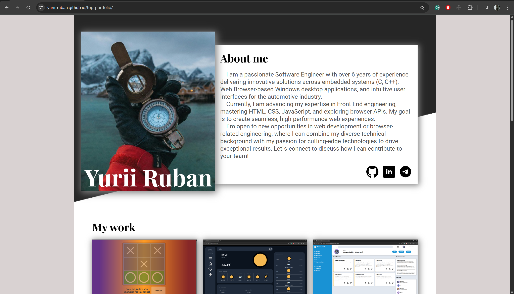
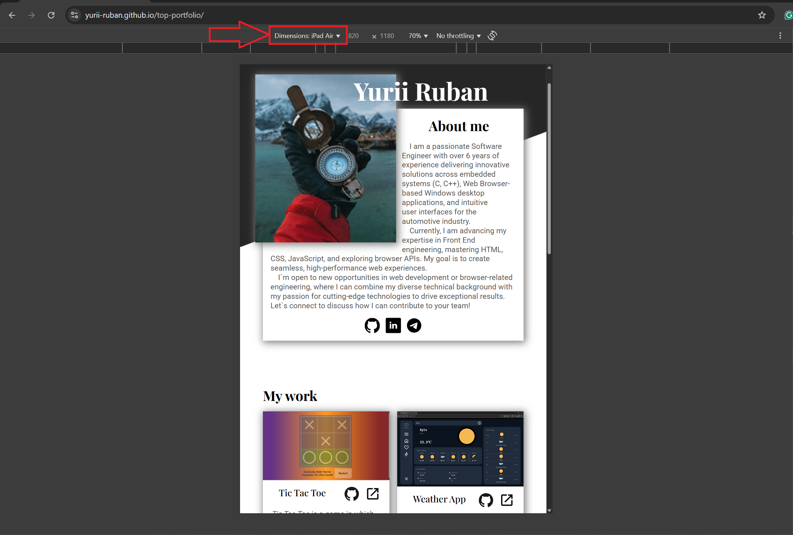
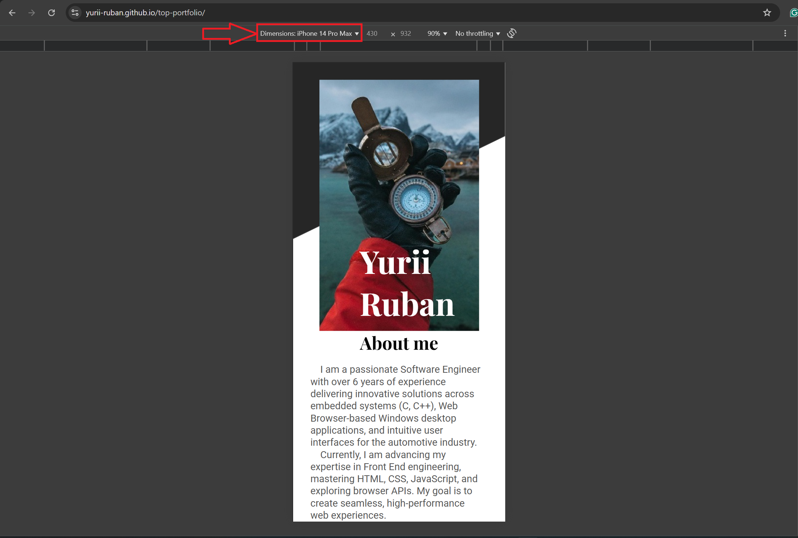

# TOP Portfolio Project

**Portfolio** project from [The Odin Project](https://www.theodinproject.com/about) course

## Preview link

https://yurii-ruban.github.io/top-portfolio

## Technologies used

- HTML
  - Default boilerplate code
  - Imported fonts
- CSS
  - Basic styling
  - Flexbox layout
  - Grid layout
  - Media queries
  - Responsive Images
  - Art Direction

## Purpose

The **Portfolio** project aims to create my own portfolio web-page, which covers several project I've done in scope of this course.
The only requirement is proposed: the page should be adaptive and it should look pretty on 3 types of devices: `Desktop`, `Tablet`, and `Mobile`.

Here are the [instructions](https://www.theodinproject.com/lessons/node-path-javascript-weather-app) for this task you could rely on.

## Screenshot

Here is some screenshots how it could look with different screen sizes

### Desktop screens

### Tablet screens

### Mobile screens

